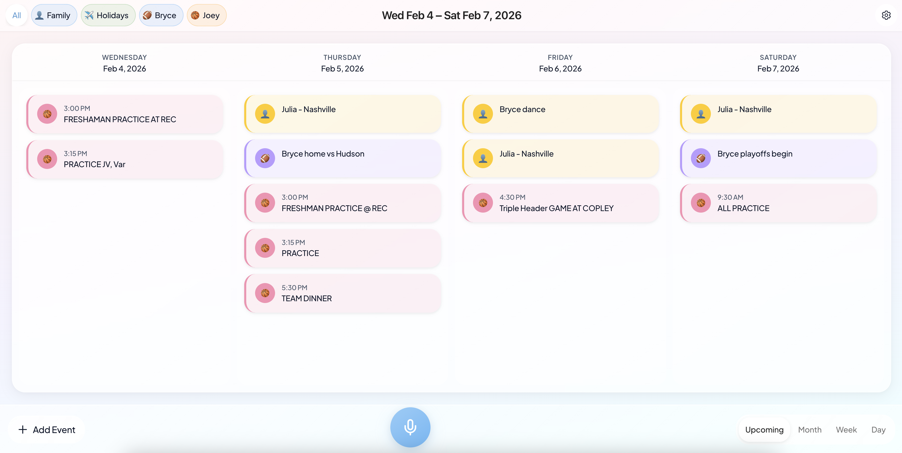

# Chronos - Family Calendar App

A family calendar web application built with TanStack Start, React, TypeScript, and Tailwind CSS.



## Features

- Calendar management with Google Calendar
- Family member organization and calendar linking
- Voice input to add events (Web Speech API + Claude)
- Modern UI with Tailwind CSS and glass-morphism themes
- Type-safe with TypeScript

## Development

### Prerequisites

- Node.js 18+ and npm

### Setup

1. Install dependencies:
   ```bash
   npm install
   ```

2. (Optional) Add `.env.local` in the project root for:
   - **Google OAuth (browser):** `VITE_GOOGLE_WEB_CLIENT_ID`, `VITE_GOOGLE_WEB_CLIENT_SECRET` — see [GOOGLE_OAUTH_SETUP.md](./GOOGLE_OAUTH_SETUP.md).
   - **AI event parsing:** `ANTHROPIC_API_KEY` (server-side; used by `/api/parse-event`). Optional: `ANTHROPIC_MODEL` (default: `claude-sonnet-4-20250514`).

3. Start the dev server:
   ```bash
   npm run dev
   ```

   Open http://localhost:5173 (or the port shown). The app uses Web Speech API for voice input (best in Chrome).

### Available Scripts

- `npm run dev` - Start dev server with hot reload
- `npm run build` - Build for production (client + server)
- `npm run preview` - Preview production build locally
- `npm run lint` - Run ESLint
- `npm run format` - Format code with Prettier
- `npm run typecheck` - Run TypeScript type checking

## Project Structure

```
/src
  /components   # React UI components
  /hooks        # React hooks
  /routes       # TanStack Router file-based routes (pages + API)
  /services     # Client services (auth, calendar, voice, AI client)
  /shared       # Shared types and constants
  /store        # Zustand store
  /styles       # Theme and styling helpers
```

## API Routes

- **POST `/api/parse-event`** — Parses voice transcription into a calendar event using Claude. Body: `{ "transcription": "..." }`. Requires `ANTHROPIC_API_KEY` on the server (no API key in the browser).

## Deployment (Vercel)

1. Connect the repo to Vercel.
2. Set env vars: `ANTHROPIC_API_KEY` (and optionally `ANTHROPIC_MODEL`) for the parse-event API; for Google OAuth use your deployment origin for redirect URIs and set `VITE_GOOGLE_WEB_CLIENT_ID` and `VITE_GOOGLE_WEB_CLIENT_SECRET`.
3. Build command: `npm run build`; output directory: `dist/client`. The current `vercel.json` deploys the client as a static SPA. For **server API routes** (e.g. `/api/parse-event`) to work on Vercel, you need to use [TanStack Start’s Vercel/Nitro integration](https://vercel.com/docs/frameworks/full-stack/tanstack-start) or deploy the API separately.

## License

MIT
